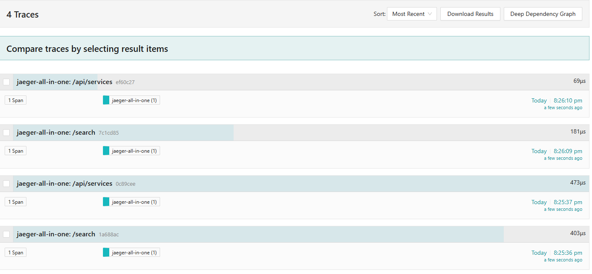
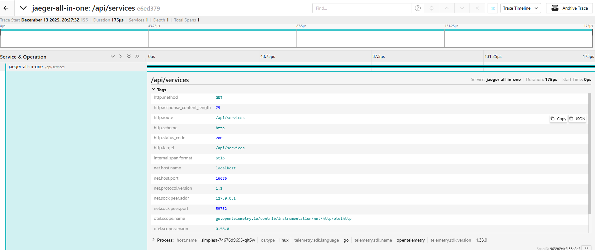

# Task3.1 — Tracing MVP (OpenTelemetry + Jaeger) в Kubernetes (Minikube)

MVP состоит из двух сервисов:
- **service-a** — REST `GET /`, вызывает service-b
- **service-b** — REST `GET /`, возвращает ответ

Трейс должен быть единым: запрос в service-a + downstream-вызов service-b видны как один trace в Jaeger UI. :contentReference[oaicite:0]{index=0}

---

## Требования

- Minikube
- kubectl
- Docker

---

## Структура проекта

- `services/service-a/` — код и Dockerfile для service-a
- `services/service-b/` — код и Dockerfile для service-b
- `k8s/services.yaml` — манифесты Kubernetes для сервисов
- `k8s/jaeger-instance.yaml` — инстанс Jaeger (через Jaeger Operator) :contentReference[oaicite:2]{index=2}

---

## Запуск

### 1) Стартуем Minikube

```bash
minikube start --addons=ingress
````

Ingress нужен для вызовов. ([GitHub][1])

---

### 2) Устанавливаем cert-manager

```bash
kubectl apply -f k8s/cert-manager.yaml
```

([GitHub][1])

---

### 3) Разворачиваем Jaeger (Operator + Instance)

```bash
kubectl create namespace observability
kubectl apply -f k8s/jaeger-operator.yaml -n observability
kubectl apply -f k8s/jaeger-instance.yaml
```

([GitHub][1])

Проверка (опционально):

```bash
kubectl -n observability get pods
kubectl -n observability get svc
```

---

### 4) Собираем Docker-образы сервисов внутрь Minikube

```bash
minikube image build -t service-a:latest services/service-a/
minikube image build -t service-b:latest services/service-b/
```

([GitHub][1])

---

### 5) Деплоим сервисы в Kubernetes

```bash
kubectl apply -f k8s/services.yaml
```

([GitHub][1])

Проверка:

```bash
kubectl get pods
kubectl get svc
```

---

## Проверка работы

### 1) Открываем Jaeger UI

```bash
kubectl -n observability port-forward svc/simplest-query 16686:16686
```

Открыть в браузере: [http://localhost:16686](http://localhost:16686) ([GitHub][1])

---

### 2) Делаем тестовый запрос

Запрос к **service-a**, который внутри вызывает **service-b**:

```bash
kubectl exec -it $(kubectl get pods -l app=service-a -o jsonpath='{.items[0].metadata.name}') -- bash
```

В поде

```bash
root@service-a-7698599cc7-5z4gr:/app# apt update && apt install curl -y
root@service-a-7698599cc7-5z4gr:/app# curl http://service-a:8080
```

([GitHub][1])

---

## Что смотреть в Jaeger

1. В сервисах выбрать `service-a`
2. Открыть свежий trace
3. Внутри должны быть спаны:

    * входящий HTTP в `service-a`
    * клиентский вызов `service-b`
    * входящий HTTP в `service-b`





[1]: https://github.com/Yandex-Practicum/architecture-alexandrite-k8s-trace "GitHub - Yandex-Practicum/architecture-alexandrite-k8s-trace"
