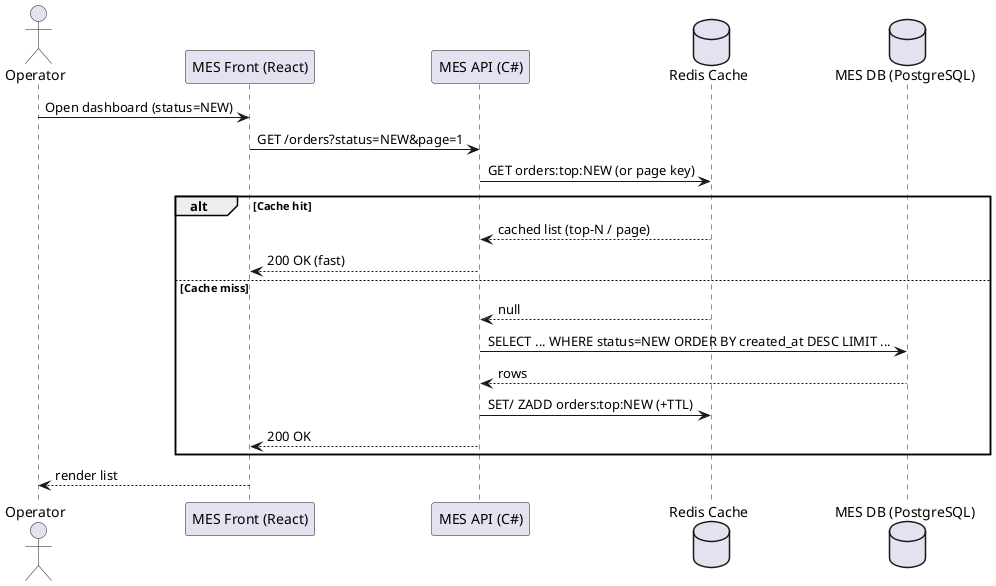
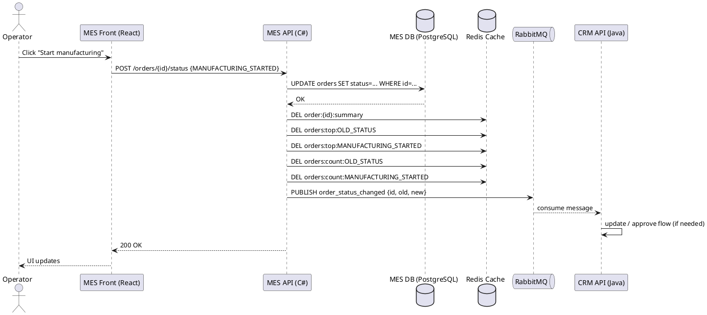

# Архитектурное решение по кешированию

## 1. Контекст и проблематика

MES рассчитывает стоимость изделия (2–3 минуты в среднем, до 30 минут на сложных моделях) и стал принимать больше заказов (в т.ч. через API), из-за чего выросли жалобы клиентов и операторов.

Отдельная боль операторов: **медленно прогружается первая страница MES** - дашборд «список заказов в работе по статусам». Раньше показывали всё - тормозило, добавили фильтр по статусам и пагинацию - **не помогло**. Операторам важно видеть самые новые заказы (это влияет на оплату).

---

## 2. Что имеет смысл кешировать

### 2.1. Главная цель кеширования

Ускорить **чтение** дашборда MES (read-heavy нагрузка), снизить нагрузку на MES DB и уменьшить p95/p99 latency на:

* получение списка заказов по статусам (сортировка “самые новые сверху”),
* получение агрегатов для карточек/табов (например, “сколько заказов в статусе X”).

### 2.2. Что кешируем (read model / view data)

1. **Списки заказов по статусу** (самые новые N):

* `orders:list:{status}:page:{k}` или (лучше) `orders:top:{status}` (top-N).

2. **Агрегаты по статусам**:

* `orders:count:{status}`

3. (Опционально) **карточки заказа** для быстрого открытия деталей:

* `order:{order_id}:summary` (короткая сводка, без тяжёлых полей)

Не кешируем “долго”:

* результаты расчёта цены на 3D-модели (это отдельная история: асинхронщина/идемпотентность/очередь). Здесь фокус именно на **дашборде**.

---

## 3. Мотивация

### 3.1. Почему кеширование нужно

* Снижаем время загрузки первой страницы MES.
* Уменьшаем нагрузку на базу MES (меньше тяжёлых SELECT с сортировками/фильтрами).
* Стабилизируем систему при всплесках заказов.

### 3.2. Какие элементы включаем в кеширование

* MES Frontend (React): только стандартное клиентское кеширование для статики (ETag/Cache-Control) - приятный бонус, но не решает проблему дашборда.
* MES Backend (C#): **основное серверное кеширование**.
* Redis (внешний distributed cache), чтобы кеш был общий для инстансов в будущем (и пригодится при переезде в Kubernetes).

---

## 4. Предлагаемое решение

### 4.1. Тип кеширования: серверное (основное) + немного клиентского (вторично)

**Почему серверное:**

* Узкое место - получение данных с MES backend/DB при построении дашборда, а не загрузка JS-бандла.
* Нужен общий кеш на всех пользователей/операторов.
* Можно управлять консистентностью и инвалидацией при смене статусов.

Клиентское кеширование:

* для статики SPA (JS/CSS) и справочников (если есть редкие справочники).
* для дашборда - *не полагаемся*, чтобы “самые новые” не превращались в “самые вчерашние”.

### 4.2. Паттерн: Cache-Aside + короткий TTL + программная инвалидация

**Cache-Aside (ленивое заполнение):**

* при чтении сначала проверяем Redis,
* при промахе читаем из БД, кладём в Redis, отдаём клиенту.

**Почему не Write-Through:**

* мы кешируем в основном *представления (списки/агрегаты)*, а не “сущность заказа один-в-один”.
* на запись статуса пришлось бы синхронно пересчитывать много ключей - риск роста латентности операции изменения статуса.

**Почему не Refresh-Ahead как базовый (сразу):**

* требует фоновых воркеров, планировщиков и аккуратной настройки - для команды из 1 C# разработчика и одного DevOps это может быть тяжеловато прямо сейчас .
* но Refresh-Ahead можно добавить точечно позже для “самых горячих” ключей.

### 4.3. Ключи, TTL, структура

**Redis структуры:**

* `orders:top:{status}` - Sorted Set (score = timestamp создания/обновления), хранить top-N (например, 200–1000).
* `orders:count:{status}` - String/Hash.

**TTL:**

* `orders:top:{status}`: 5–15 секунд (очень коротко, чтобы “самые новые” были реально новые).
* `orders:count:{status}`: 5–15 секунд.
* `order:{id}:summary`: 30–120 секунд (детали не настолько критичны по свежести).

---

## 5. Стратегия инвалидации кеша

Используем **гибрид**:

1. **Программная инвалидация по ключу** - при изменении статуса заказа.
2. **Временная (TTL)** как страховка от рассинхронизации.

### 5.1. При изменении статуса (основной сценарий)

Когда оператор меняет статус заказа (например, `MANUFACTURING_STARTED`) :

* MES API пишет изменение в MES DB (источник истины),
* затем:

    * удаляет/обновляет кеши списков для **старого и нового статуса**,
    * обновляет `orders:count:*`,
    * удаляет `order:{id}:summary` (чтобы пересобрался).

Почему так:

* это самая точная стратегия для дашборда,
* TTL один не подходит: операторам важно видеть свежак прямо сейчас .

### 5.2. Почему “только TTL” хуже

* при TTL 30–60 секунд операторы будут видеть устаревшие данные (конфликт с мотивацией “кто успел - тот и получил оплату”) .
* при TTL 1–5 секунд без инвалидации - будет много промахов и всё равно нагрузим БД.

---

## 6. Диаграммы последовательности (Sequence diagram)

### 6.1. Чтение списка заказов (дашборд по статусу)

### 6.2. Запись: изменение статуса заказа оператором

---

## 7. Сравнение стратегий инвалидации

| Стратегия            | Плюсы                         | Минусы                                                                     | Итог для MES дашборда        |
|----------------------|-------------------------------|----------------------------------------------------------------------------|------------------------------|
| Только TTL           | просто                        | либо устаревает (плохо), либо слишком короткий TTL даёт промахи и нагрузку | не подходит как единственная |
| Инвалидация по ключу | свежие данные почти сразу     | сложнее код, нужно понимать какие ключи трогать                            | **лучший базовый вариант**   |
| Refresh-Ahead        | стабильная латентность чтения | нужны фоновые воркеры/расписания, сложнее эксплуатация                     | можно добавить позже точечно |

---

## 8. Варианты решений (доп. задание)

### Решение 1 (рекомендуемое сейчас): Cache-Aside + TTL + key invalidation

**Плюсы**

* Быстро даёт эффект на дашборде.
* Минимум новых компонентов: Redis + немного кода.
* Хорошо ложится на будущий Kubernetes (общий distributed cache).

**Минусы**

* Нужно аккуратно вести список ключей для инвалидирования (старый/новый статус, агрегаты).

### Решение 2 (на вырост): “Read model в Redis” (Sorted Sets + события)

Поддерживаем `orders:top:{status}` не через SELECT при промахе, а **постоянно** обновляем при событиях (создание заказа, смена статуса). Чтение почти всегда из Redis.

**Плюсы**

* Самая быстрая загрузка дашборда, минимальные запросы в БД.
* Хорошо держит всплески.

**Минусы**

* Сложнее: нужно гарантировать доставку/идемпотентность событий, восстановление read model.

**Заключение:** стартуем с **Решения 1**, потому что оно даёт заметный выигрыш с меньшим риском и трудозатратами, а затем при необходимости эволюционируем в Решение 2.

